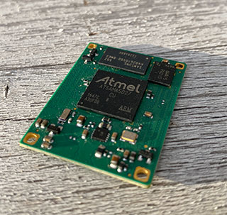

# Banco di test per RoadRunner

## Ambiente

* [Preparazione MicroSD con BuildRoot e librerie Microchip MPIO](https://www.acmesystems.it/roadrunner_buildroot)

## Programmi

* [trrSer.py](trrSer.py) Programma di test nuovo
* [trrRob.py](trrRob.py) Programma di test precedente
* [trrlib.py](trrlib.py) Funzioncine varie
* [solo_gpio.py](solo_gpio.py) Test delle sole linee di GPIO

## Esempio GPIO output con libreria mpio

	from mpio import GPIO
	from trrlib import pin2id
	from time import sleep

	gpio = GPIO(pin2id("PA17"), GPIO.OUT)
	gpio.set(True)
	sleep(1)   
	gpio.set(False)

## Esempio GPIO input con libreria mpio

	from mpio import GPIO
	from trrlib import pin2id

	gpio = GPIO(pin2id("PA17"), GPIO.IN)
	print gpio.get()

### Links

* [RoadRunner home page](https://www.acmesystems.it/roadrunner)
* [RoadRunner devdoc](https://www.acmesystems.it/doc_roadrunner)
* [RoadRunner buy](https://www.acmesystems.it/catalog_roadrunner)
* [Microchip Peripheral I/O Python Package](https://www.acmesystems.it/roadrunner_mpio)

